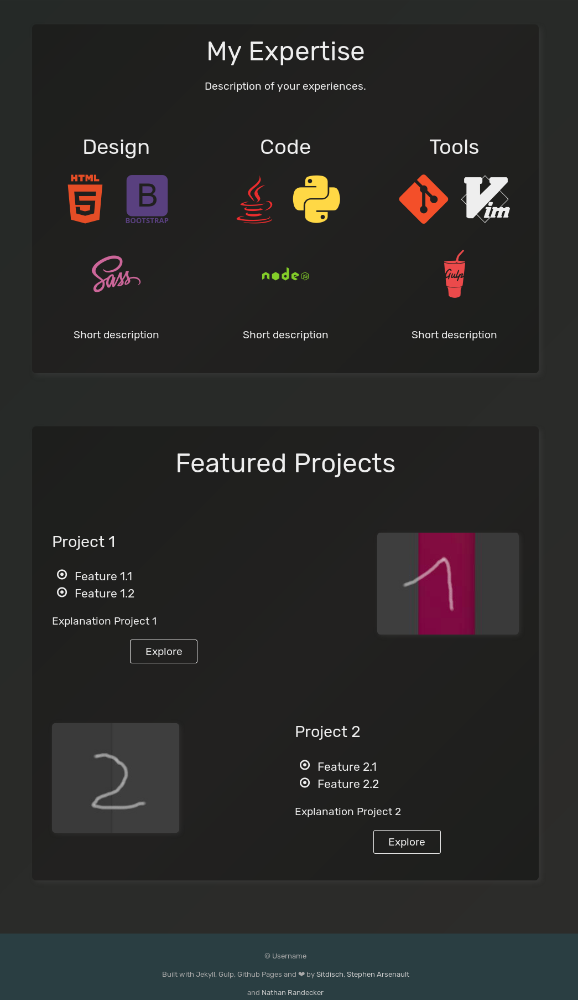
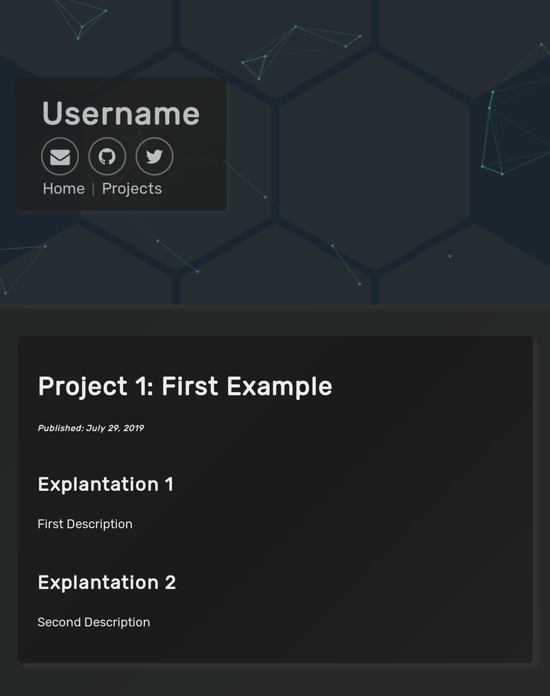

# Dark Particle Jekyll Theme

## Preview - [Demo](https://sitdisch.github.io/Dark-Particle/)





This is a simple dark jekyll theme blueprint. You can use it as a start template to make your web appearance and portfolio awesome :smile:. It heavily based on the magnificent work of [Stephen Arsenault](https://github.com/s-arsenault/s-arsenault.github.io) and [Nathan Randecker](https://github.com/nrandecker/particle).

## Table of Contents

- [Features](#features)
- [Setup at GitHub Pages](#setup-at-github-pages)
- [Site and User Settings](#site-and-user-settings)
- [Other Customization](#other-customization)
- [Local Running](#local-running)
- [Credits](#credits)
<p></p>

## Features

- Gulp
- SASS
- Sweet Scroll
- Particle.js
- BrowserSync
- Font Awesome and Devicon icons
- Google Analytics
- Info Customization

## Setup at GitHub Pages

Here is a procedure to publicize your pages at GitHub Pages:
1.  <a class="github-button" href="https://github.com/sitdisch/Dark-Particle/fork" data-icon="octicon-repo-forked" aria-label="Fork sitdisch/Dark-Particle on GitHub">fork</a> this repository to your GitHub account
2. edit the `_config.yml` to start your customization
3. publicize your customized repository on [GitHub Pages](https://help.github.com/en/articles/configuring-a-publishing-source-for-github-pages)
4. access your pages at `https://<username>.github.io/Dark-Particle/` and be proud 

Consider: your changes maybe take a while to occur at GitHub Pages

## Site and User Settings

Start your customization e.g. while you adapt the `_config.yml` file.

```
# Site settings
title: # insert a page-name
description: # insert a website description.

# User settings
username: # insert a username
user_title: # insert your title
user_picture: # insert a path to your pic e.g. "/assets/img/User_picture.png"
user_description: # descripe your experiences
email: # insert your_email_address
github_username: # insert your github username       
twitter_username: # insert your twitter username     
youtube_username: # insert your youtube username     
linkedin_username: # insert your linkedin username   
facebook_username: # insert your facebook username   
instagram_username: # insert your instagram username 

# Google-analytics
google-analytics:
  id: # insert your id
```
Consider: the icons of Twitter etc. will occur automatically, if you set a username

## Other Customization
- Appearance Customization
  - edit the scss files located at `src/styles/`
		- Consider: maybe you have to run `sudo gulp` again to see your changes
- Particle Customization
  - edit the json data of the particle function at `/src/js/app.js`
  - look at [Particle.js](https://github.com/VincentGarreau/particles.js/) for help


## Local Running

In order to compile the assets and run the pages locally you will need to do the following:

- Install [NodeJS and npm](https://nodejs.org/en/download/package-manager/)
  - for Ubuntu:
    - `sudo apt install nodejs`
    - `sudo apt install npm`
- install [yarn](https://yarnpkg.com/) `sudo npm install -g yarn`
- install [gulp](https://gulpjs.com/) `sudo npm install -g gulp`
- install [ruby](https://www.ruby-lang.org/en/) and [bundler](https://bundler.io/)
  - for Ubuntu:
    - `sudo apt-get install ruby-full build-essential zlib1g-dev`
    - `echo '# Install Ruby Gems to ~/gems' >> ~/.bashrc`
    - `echo 'export GEM_HOME="$HOME/gems"' >> ~/.bashrc`
    - `echo 'export PATH="$HOME/gems/bin:$PATH"' >> ~/.bashrc`
    - `source ~/.bashrc`
    - `sudo gem install bundler`
- clone this repository `git clone https://github.com/sitdisch/Dark-Particle` or your fork to your local machine
- be sure your current directory is `.../Dark-Particle`
- run `sudo bundle install`
- install the [dependencies](https://yarnpkg.com/lang/en/docs/installing-dependencies/) (run `yarn`)
- run `sudo gulp` 
  - if you get this kind of trouble `you Have Already Activated...` look [here](https://wholesome-sj.github.io/2019-07-15-jeklly-page-gem-errors-handling-%27you-have-already-activated%27) and do e.g. `sudo gem uninstall liquid`
- if it works, you will find your pages at `http://localhost:3000`

## Credits

Dark-Particle based on the extraordinary work of:
- [Stephen Arsenault](https://github.com/s-arsenault/s-arsenault.github.io)
- [Nathan Randecker](https://github.com/nrandecker/particle)
- [Willian Justen](https://github.com/willianjusten/will-jekyll-template)
- [Vincent Garreau](https://github.com/VincentGarreau/particles.js/)
- and me [Sitdisch](https://github.com/sitdisch)
